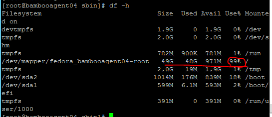

## [DevOps]/[Bamboo]/[Agent]/increasee-agent-space

1. Issue
> Failed to execute goal org.apache.maven.plugins:maven-war-plugin:2.2:war (default-war) on project: Error assembling WAR: IOException when zipping WEB-INF/lib/pdf-11.6.0.jar: No space left on device -> 
2. Sln
> df -h   check the space

> assign more space to VMV via VM client

> assign more space to the path

[DevOps]: <../../README.md>
[Bamboo]: <../bamboo.md>
[Agent]: <../agent/agent.md>