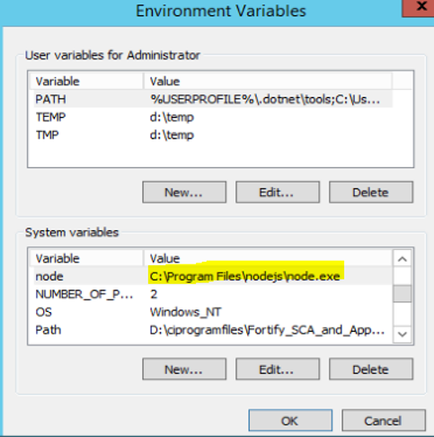
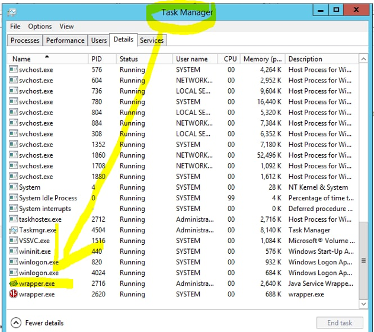
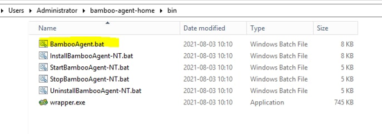

## [DevOps]/[Bamboo]/[Agent]/window-agent-config

1. add private nuget here 
> default path for windows is> "C:\Users\<username>\.nuget\packages"
2. install node.js
> https://nodejs.org/en/download/
Set sys env variables

> Rem to retsrat the bamboo ganet to make it can get latest PATH, u can go to next page for  the step

3. Restart bambooagent
> stop the highlight task manually as below

> run the bambooagent bat

[DevOps]: <../../README.md>
[Bamboo]: <../bamboo.md>
[Agent]: <../agent/agent.md>