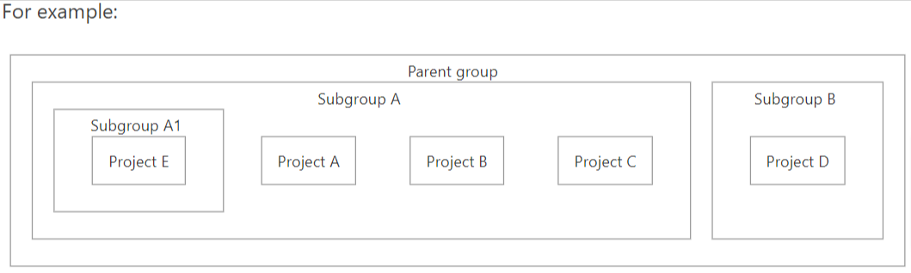

## [DevOps]/[GitLab]/Bamboo2GitLab

- [migration-from-atlassian-bamboo-server-to-gitlab-ci-1](https://about.gitlab.com/blog/2022/07/06/migration-from-atlassian-bamboo-server-to-gitlab-ci/)

- [migration-from-atlassian-bamboo-server-to-gitlab-ci-2](https://about.gitlab.com/blog/2022/07/11/how-to-migrate-atlassians-bamboo-servers-ci-cd-infrastructure-to-gitlab-ci-part-two/v)
---
1 - Bitbucket to Gitlab
[Import your project from Bitbucket Server](https://docs.gitlab.com/ee/user/project/import/bitbucket_server.html)

    > From Bitbucket Server, you can import:
    > Repository description
    > Git repository data
    > Pull requests
    > Pull request comments

2 - [Subgroups](https://docs.gitlab.com/ee/user/group/subgroups/index.html)

> Not recommend to use this feature before Gitlab fix it
There is a bug that causes some pages in the parent group to be accessible by subgroup members. For more details, see this issue.

3 - .gitlab-ci.yml

Validate GitLab CI/CD configuration
1 - If you use the pipeline editor, it verifies configuration syntax automatically.
2 - If you use VS Code, you can validate your CI/CD configuration with the GitLab Workflow VS Code extension.

Check CI/CD syntax
To check CI/CD configuration with the CI lint tool:
On the top bar, select Menu > Projects and find your project.
On the left sidebar, select CI/CD > Pipelines.
In the top right, select CI lint.
Paste a copy of the CI/CD configuration you want to check into the text box.
Select Validate

- [access and permissions](https://docs.gitlab.com/ee/user/group/access_and_permissions.html
)

---
[DevOps]: <../../README.md>
[GitLab]: <../GitLab.md>
