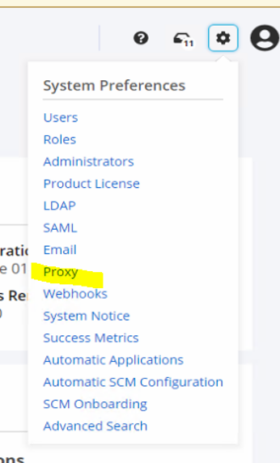
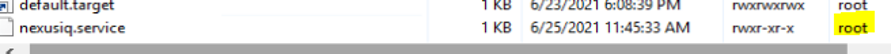
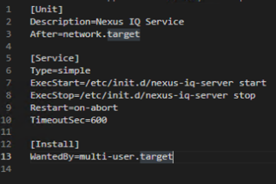
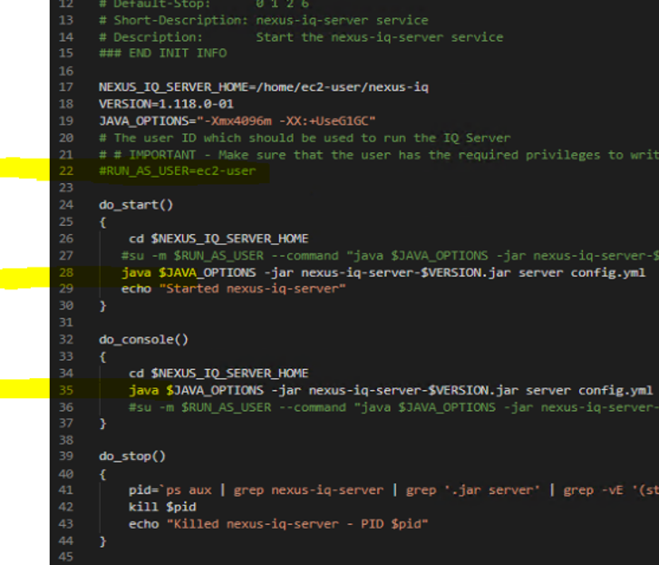

[](https://help.sonatype.com/iqserver)
## [DevOps]/[Nexus]/[IQ]


```sh
mvn dependency:tree
```

- [Installation](https://help.sonatype.com/iqserver/installing/iq-server-installation
)

1. Lic
If you need to go through an http proxy server to get to the internet you can configure it in the web UI.  
 
Before install lic, set proxy


2. [run-as-a-service - systemd](https://help.sonatype.com/iqserver/installing/running-iq-server-as-a-service)
   
    - /etc/systemd/system/nexusiq.service
    
     
    - /etc/init.dnexus-iq-server
     


- [IQ Scan](https://help.sonatype.com/integrations/nexus-iq-cli
)
```sh
java -jar [nexus-iq-cli jar] -i [application id] -s [server URL] -a [username:password] [target] 

```


------
[DevOps]: <../../README.md>
[Nexus]: <../nexus.md>
[IQ]: <IQ.md>