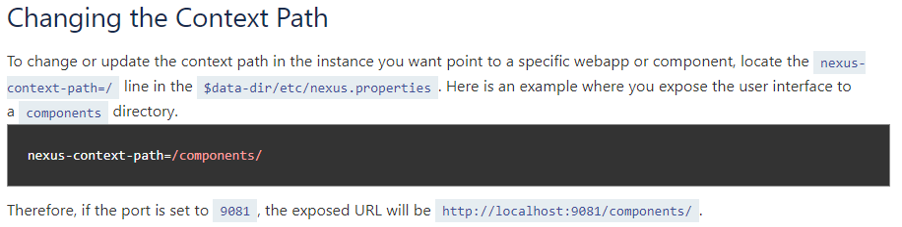
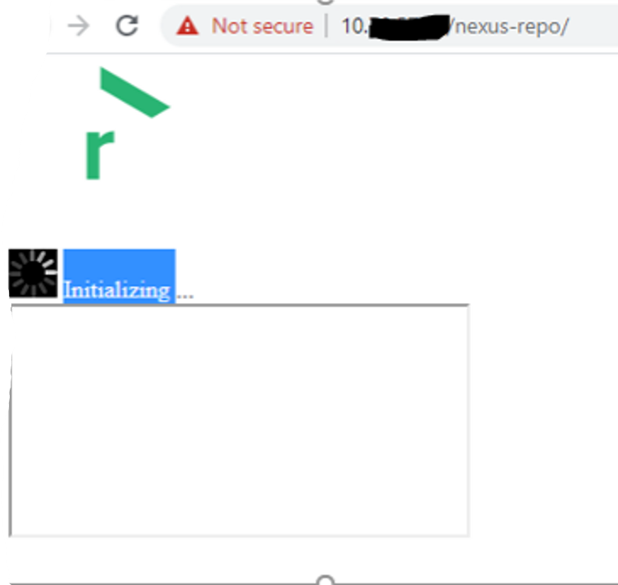
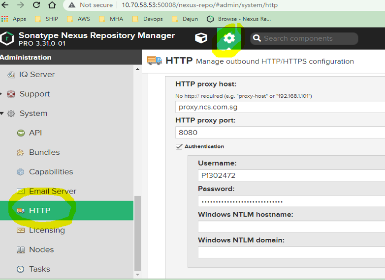
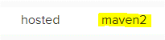
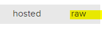
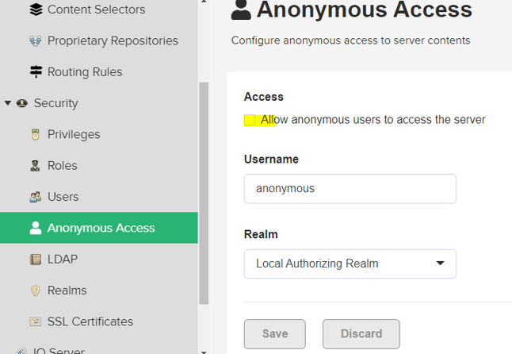

[](https://help.sonatype.com/repomanager3)
## [DevOps]/[Nexus]/Repo

- [setup private repo](https://cloud.tencent.com/developer/article/1401023)

1. [Install](https://help.sonatype.com/repomanager3/installation/installation-methods#InstallationMethods-RunningRepositoryManagerintheForeground)

    - [Running Repository Manager in the Foreground]
        > Your init admin user password is locatedin/opt/nexusrepo/sonatypework/nexus3/admin.password
    - Start nexuerepo
        > cmd - ../bin/ - ./nexus run
    - [run-as-a-service -- systemd](https://help.sonatype.com/repomanager3/installation/run-as-a-service )
    - Context Path
    


2. [Run Behind a Reverse Proxy](https://help.sonatype.com/repomanager3/installation/run-behind-a-reverse-proxy
)
    > Issue1 -- https reverse url keep initializing
    > Sln -- add RequestHeader set X-Forwarded-Proto https in 443 port
    


4.  set proxy to make repo can download from internet


- [Upload artifacts to nexus repo]
   
    - [Use Maven to upload](https://help.sonatype.com/repomanager3/nexus-repository-administration/formats/maven-repositories)
    ```sh
    -settings settings.xml  deploy:deploy-file -DpomFile=${bamboo.nexus.artifactrepository.extensionartifact.id}/pom.xml -DrepositoryId=${bamboo.maven.settings.server.id} -Durl=${bamboo.nexusrepo.url}/repository/${bamboo.nexus.artifactrepository.id}/ -Dfile=${bamboo.nexus.artifactrepository.extensionartifact.id}/target/abc.war
    ``` 
    > note: Repo format as below 
    

    - [Use Curl](https://help.sonatype.com/repomanager3/nexus-repository-administration/formats/raw-repositories)

    ```sh
    curl  -u ${bamboo.buildmaster.username}:$   {bamboo.buildmaster.password} \
    --upload-file ${bamboo.userinput.executesql.    folder}.tar \
    ${bamboo.ship.nexusrepo.url}/repository/    {bamboo.nexus.artifactrepository.iddejun.tar

    ```
    > note: Repo format as below 
    

- Remember to disabled Anonymous Access 
     


------
[DevOps]: <../../README.md>
[Nexus]: <../nexus.md>