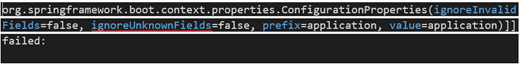
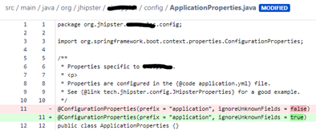
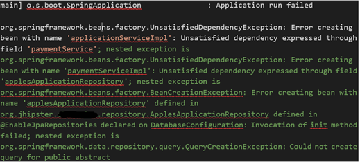
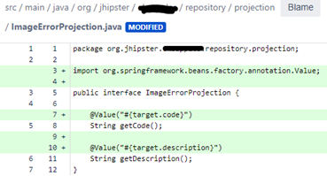
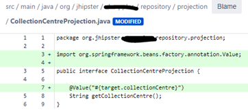
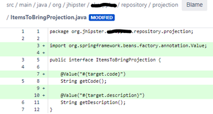
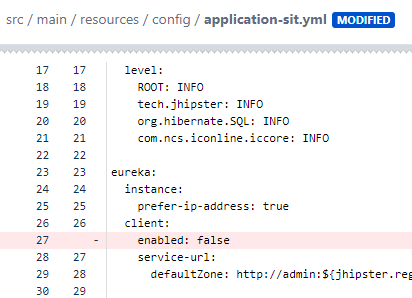

## [DevOps]/[AWS]/[EKS]/EC2 to EKS

### Some points during app convert from ec2 to EKS

1.DB 
> In Json and Yaml, secret data(db username and password) need use base64 decoded values
> 
2.Jhipster version
> Jhipster need upgrade both Dev and Ops sides – jhipster-register

3.Configration

> Issue1 - ignoreUnknownFields
-- Issue

-- Background
We use Jhipster to create the app framework, it will    have somedefault setting, like the ignoreUnknownFields check.
--Sln   
Make ‘ignoreUnknownFields = true’ (set application    
properties to ignore unmapped fields as they are    
configured in their respective configuration classes    
via annotations)

> Issue2 - jpa query creation exception

-- Issue

-- Background
Should be the Jhipster side issue
--Sln 
Make below changes

    
    

4.eureka enable

Remove the false to make JHipster can discovery the eureka
eureka-enable

[DevOps]: <../../README.md>
[AWS]: <../aws.md>
[EKS]: <../eks.md>