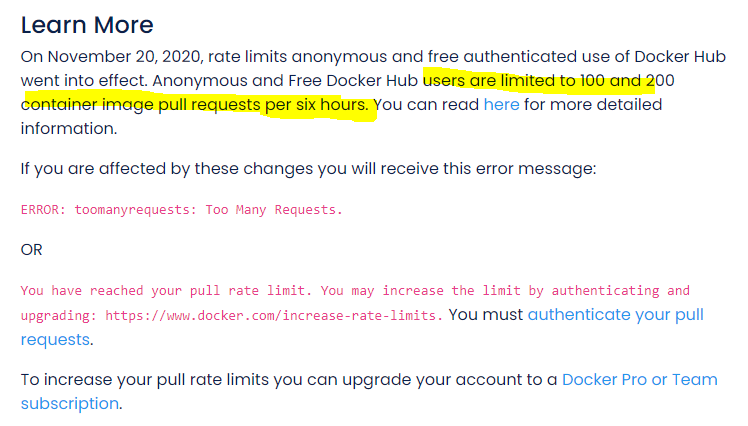

## [DevOps]/[Docker]/Docker build


- [Docker build]

    ```sh
    docker run -d -p 80:80 docker/getting-started
    ```

    ```sh
    docker rmi ${docker.image.name}:${version}
    docker build --force-rm=true -t ${docker.image.name}:$  {version} -f Dockerfile .
    docker images
    ```

- [dockerfile_best-practices]
- [Alpine VS Ubuntu]
- [Buildpacks vs Jib vs Dockerfile](https://cloud.google.com/blog/topics/developers-practitioners/comparing-containerization-methods-buildpacks-jib-and-dockerfile)

- [Issue - toomanyrequests](https://www.docker.com/increase-rate-limits)
  
    ```log
    Step 1/13 : FROM adoptopenjdk/openjdk11:jre-11.0.11_9-alpine
    jre-11.0.11_9-alpine: Pulling from adoptopenjdk/openjdk11
    error	
    toomanyrequests: You have reached your pull rate limit. You     may increase the limit by authenticating and upgrading:     https://www.docker.com/increase-rate-limit
    ```
    


----
[DevOps]: <../../README.md>
[Docker]: <./docker.md>

[Docker build]: <https://docs.docker.com/develop/develop-images/build_enhancements/>

[dockerfile_best-practices]: https://docs.docker.com/develop/develop-images/dockerfile_best-practices/
[Alpine VS Ubuntu]: (https://jfrog.com/knowledge-base/why-use-ubuntu-as-a-docker-base-image-when-alpine-exists/)]


