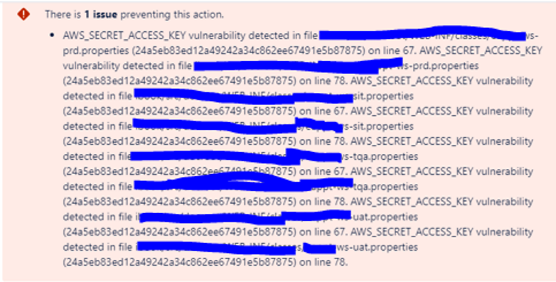
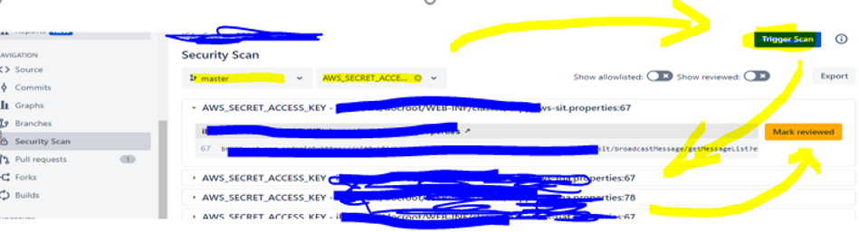
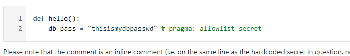
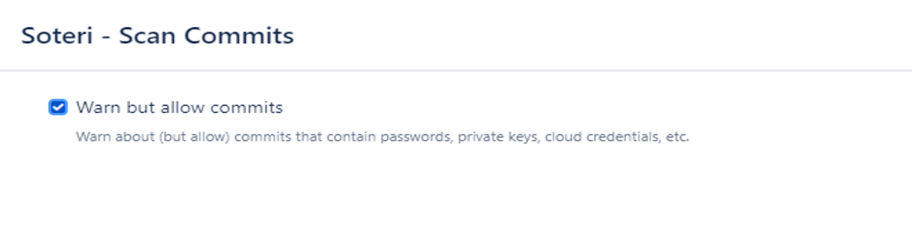

## <ins>[DevOps]/[Git]/[bitbucket]/security-scan

#### Issue1 – Bitbucket push or Pull request failed due to below error

- Root Cause – bitbucket add a ‘Security Scan’ to detect codes 
https://marketplace.atlassian.com/apps/1221399/security-for-bitbucket-soteri?hosting=server&tab=overview
https://docs.soteri.io/security-for-bitbucket/3.1.1/Vulnerabilities-Detected-by-Security-for-Bitbucket.14497087541.html

- Sln – pass the scan
    1. go to the security scan - > select the branch and the rule u break
    2. check the findings -> fixed the code or mark as false positive
    3. re-click the merge button 
    
    4. add comments to whitelist if still failed , and absolutely necessary "pragma: allowlist secret"
    
    5. Optimized – enable below in project level setting to make Dev smoothly
    
    

---
[DevOps]: <../../README.md>
[Git]: <../Git.md>
[bitbucket]: <./bitbucket.md>