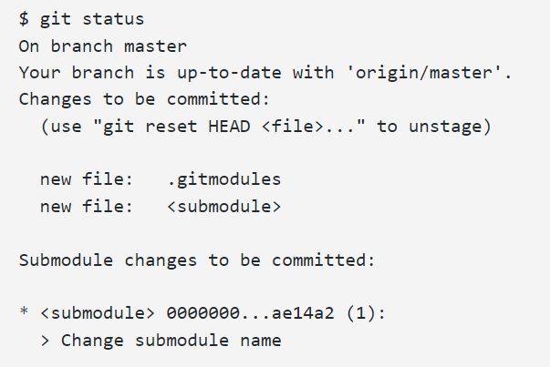
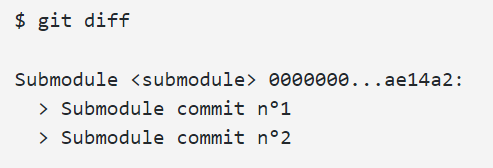

[](https://git-scm.com/book/en/v2/Git-Tools-Submodules)
## <ins>[DevOps]/git-submodule


#### [git-submodule]

- [add-and-update-git-submodules](https://devconnected.com/how-to-add-and-update-git-submodules/)


> git-submodule is like a third-party library, used as denpendency

### Noted : --recursive
```sh
#use --recursive for nested submodules 
git submodule update --init
# if there are nested submodules:
git submodule update --init --recursive
```

#### Git Add
```sh
#add into your repo
git submodule add <remote_url>
```

#### Git Push
```sh
# push submodule as a part of your repo
$ git commit -m "Added the submodule to the project."
$ git push
```

#### Git Status
```sh
#check which version/tag that submodule on
cd submodule
git submodule status

> 346bfc6e82193878475c4dd8736a2aeb1a0bd9b8 devops (1.0)
```

#### Git Pull
```sh
# update submodule to remote latest version
git submodule update --remote

# pull all changes in the repo including submodules
git pull --recurse-submodules

# update to specify version/tag
git submodule update --remote
cd submodule
git fetch
git log --oneline origin/master

>93360a2 (origin/master, origin/HEAD) Second commit
 88db523 First commit
 43d0813 (HEAD -> master) Initial commit
#if you want to switch submodule to 43d0813
git checkout 43d0813
```

#### Git Clone
```sh
#Clone a project that contains a submodule
git clone --recursive [URL to Git repo]
# update submodule
git submodule update --init --recursive --remote
```

#### Git Remove
```sh
#Remove Git submodules
git submodule deinit <submodule>

git rm <submodule>
```
#### Git Configuring 
```sh
##Submodule summary for git status
git config --global status.submoduleSummary true
```

```sh
##Detailed diff for submodules for git diff
git config --global diff.submodule log

```

---

#### Git Aliases
>You may want to set up some aliases for some of these commands as they can be quite long 

```sh
git config alias.sdiff '!'"git diff && git submodule foreach 'git diff'"
git config alias.spush 'push --recurse-submodules=on-demand'
git config alias.supdate 'submodule update --remote --merge'
```


#### Issue
>- issue1 - git submodule init not pulling latest commit
    >- sln - add --recursive --remote
    >- --recursive
    only valid for foreach, update, status     and sync commands. Traverse submodules recursively
    >- --remote
    to update from remote-tracking branch

```git
git submodule update --init --recursive --remote
```

------

[DevOps]: <../../README.md>
[git-submodule]: <https://git-scm.com/docs/git-submodule>
