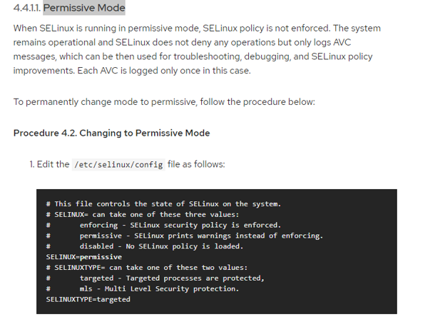

## [DevOps]/[Linux]/SELinux

- [SELinux](https://www.linuxprobe.com/selinux-introduction.html)
- [Enabling SELinux](https://access.redhat.comdocumentation/en-us/red_hat_enterprise_linux/7/htmlselinux_users_and_administrators_guidesect-Security-Enhanced_Linux-Working_with_SELinux-Changing_ELinux_Modes#sect-Security-Enhanced_Linux-Enabling_and_Disaling_SELinux-Permissive_Mode)
Permissive Mode – recommended

- [Permanent Changes in SELinux States and Modes](https://access.redhat.com/documentation/en-us/red_hat_enterprise_linux/7/html/selinux_users_and_administrators_guide/sect-security-enhanced_linux-working_with_selinux-changing_selinux_modes)

---
- [restorecon](https://blog.csdn.net/lemontree1945/article/details/79380056)
---
[DevOps]: <../../README.md>
[linux]: <./linux.md>