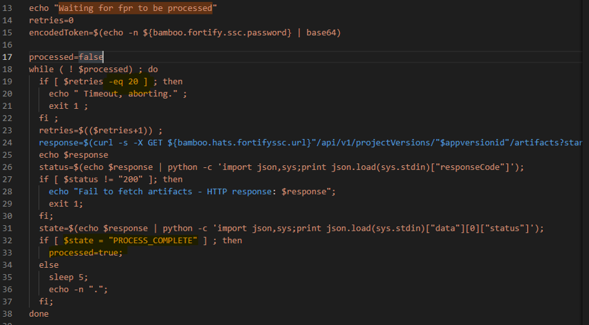

[](https://www.microfocus.com/)
## <ins>[DevOps]/[Scan]/[Fortify]/best-practices


1. FPR retries

    

2. API
    ```sh
    echo "1.Getting an Authentication Token“
    response=$(fortifyclient -url ${bamboo.fortifyssc.url} -user ${bamboo.buildmaster.username} -password $   {bamboo.buildmaster.password} token   -gettoken -gettoken AnalysisUploadToken)

    encodedToken=$(echo $response | grep -oE '[^ ]+$' | sed     -E 's/^Authorization Token: ([a-zA-Z0-9\-]+)$/\1/')

    fortifyclient -url ${bamboo.fortifyssc.url}    -authtoken $encodedToken uploadFPR -file fortify-total.    fpr -project "${bamboo.fortify.ssc.appid}" -version "1.0"

    echo "===invalidate any existing token==="
    fortifyclient -url ${bamboo.fortifyssc.url}     invalidatetoken -invalidate $encodedToken -user ${bamboo.buildmaster.username} -password ${bamboo.buildmaster.password} 
    ```


---
[DevOps]: <../../README.md>
[Scan]: <../scan.md>
[Fortify]: <../Fortify/Fortify.md>
