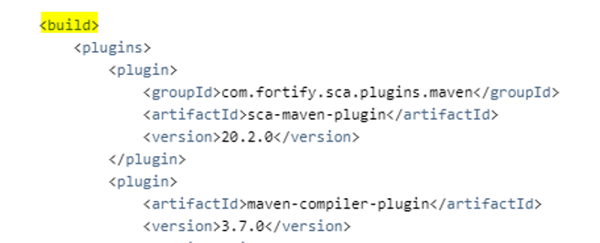

[](https://www.microfocus.com/)
## <ins>[DevOps]/[Scan]/[Fortify]/fortify-install


1. Installing Fortify Static Code 
    - Run below first
    ```sh
    sudo dnf install -y rpm-build
    ```
    - Then install
    ```sh
    ./Fortify_SCA_and_Apps__linux_x64.run --mode text
    ```
    - Configuring for Security Content Updates
    ```sh
    cd /opt/Fortify/Fortify_SCA_and_Apps_20.2.0/bin
    ```
    set proxy(host. Name, id ,pw) and run update sh as below
    

2. enable sca binary
   
    - Method A – install in agent
        > go to agent /opt/Fortify/Fortify_SCA_and_Apps_20.2.0/ plugins/   maven, unzip maven-plugin-bin.zip
        > run install.sh
        
    - sMethod B – install in local and upload into nexus repo
        > suggest u use this method to avoid to install for every agent
        > Copy /opt/Fortify/Fortify_SCA_and_Apps_20.2.0/plugins/maven to      >ur local
        > unzip maven-plugin-bin.zip
        > run install.sh
        > find the artifacts in ur maven repo, path is like       repo\com\fortify\sca\plugins\maven
        >  Upload the folder into ur nexus repo
        

3.add plugin in pom
    


---
[DevOps]: <../../README.md>
[Scan]: <../scan.md>
[Fortify]: <../Fortify/Fortify.md>
