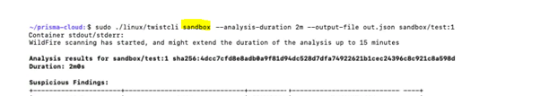

## <ins>[DevOps]/Prisma

- [Prisma Cloud can dynamically run and scan container images in a sandbox virtual machine (VM)](https://www.paloaltonetworks.com/blog/prisma-cloud/image-analysis-sandbox/#:~:text=We%20are%20happy%20to%20announce,sandbox%20virtual%20machine%20(VM))
> 

- [Enforce compliance checks](https://docs.paloaltonetworks.com/prisma/prisma-cloud/21-08/prisma-cloud-compute-edition-admin/compliance/manage_compliance)
---
[DevOps]: <../../README.md>
[Scan]: <../scan.md>
